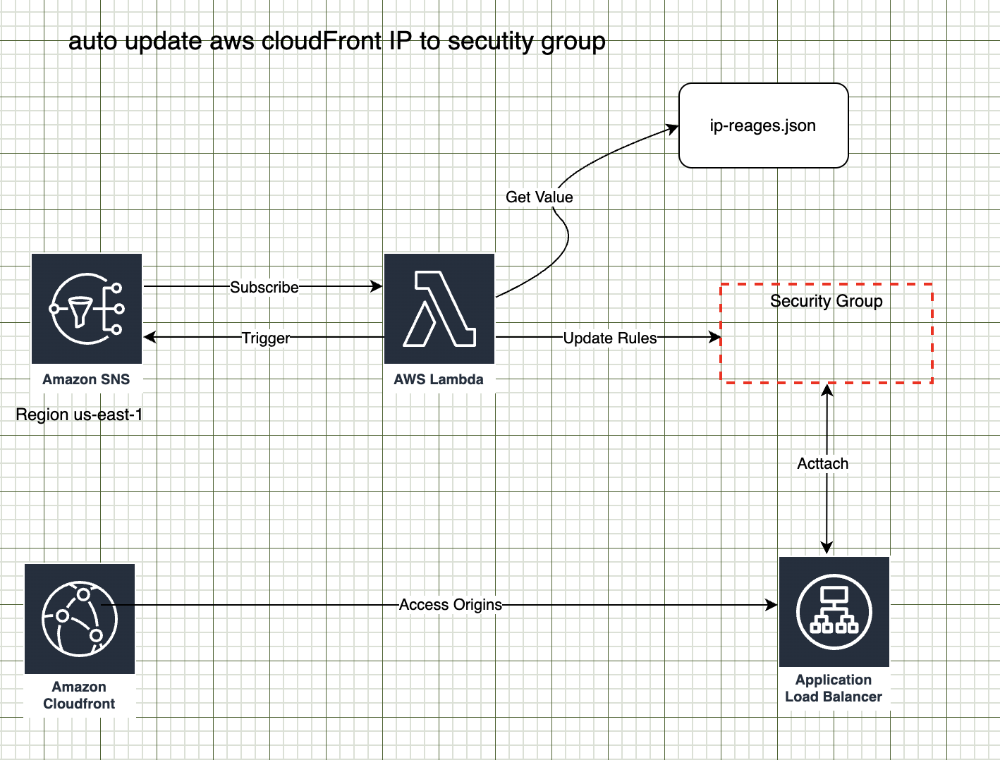

## Auto update cloudFront ip to security group Architecture



ref: [aws blog link](https://aws.amazon.com/tw/blogs/security/automatically-update-security-groups-for-amazon-cloudfront-ip-ranges-using-aws-lambda/)

ref: [ github ](https://github.com/aws-samples/aws-cloudfront-samples/tree/master/update_security_groups_lambda)


## Craete AWS IAM Policy And Role

- create policy 

```
aws iam create-policy  --policy-name autoUpdateCloudFrontIpPolicy  --policy-document '{
    "Version": "2012-10-17",
    "Statement": [
        {
            "Effect": "Allow",
            "Action": [
                "ec2:AuthorizeSecurityGroupIngress",
                "ec2:RevokeSecurityGroupIngress",
                "ec2:DescribeVpcs",
                "ec2:CreateTags",
                "ec2:ModifyNetworkInterfaceAttribute",
                "ec2:DescribeNetworkInterfaces"
            ],
            "Resource": "arn:aws:ec2:ap-southeast-1:999999999999:security-group/*"
        },
        {
            "Effect": "Allow",
            "Action": [
                "ec2:DescribeSecurityGroups",
                "ec2:DescribeSecurityGroups",
                "ec2:CreateSecurityGroup"
            ],
            "Resource": "*"
        },
        {
            "Action": [
                "logs:CreateLogGroup",
                "logs:CreateLogStream",
                "logs:PutLogEvents"
            ],
            "Effect": "Allow",
            "Resource": "arn:aws:logs:*:*:*"
        }
    ]
}'
```

- create IAM Role

```
aws iam create-role \
    --role-name autoUpdateCloudFrontIpRole \
    --assume-role-policy-document '{
    "Version": "2012-10-17",
    "Statement": [
        {
            "Effect": "Allow",
            "Action": [
                "sts:AssumeRole"
            ],
            "Principal": {
                "Service": [
                    "lambda.amazonaws.com"
                ]
            }
        }
    ]
}'

```

- attach IAM policy to role
  
```
  aws iam attach-role-policy \
    --policy-arn arn:aws:iam::999999999999:policy/autoUpdateCloudFrontIpPolicy \
    --role-name autoUpdateCloudFrontIpRole
```

## AWS SNS 

- SNS subscribe for test  - <mark>option</mark>

```
aws sns subscribe \
		--region us-east-1 \
    --topic-arn arn:aws:sns:us-east-1:806199016981:AmazonIpSpaceChanged \
    --protocol email \
    --notification-endpoint vincent@com.com
```

##  Lambda Function

Choose your region - ap-east-1

- Create lambda function
  
```
NAME="aws-changed-ip-lambda"
ROLE_ARN="arn:aws:iam::999999999999:role/autoUpdateCloudFrontIpRole"
aws lambda create-function \
    --function-name ${NAME} \
    --runtime python3.12 \
    --zip-file fileb://aws-changed-ip-lambda.zip \
    --handler lambda_function.lambda_handler \
    --timeout 60  \
    --role ${ROLE_ARN}

```
- Update lambda function configuration

```
NAME="aws-changed-ip-lambda"
VPC_ID="vpc-9987677666"
PREFIX_NAME="cloudfront_ip"
REGIOG="ap-east-1"
PORT="443"
aws lambda update-function-configuration \
    --function-name  ${NAME} \
    --timeout 60 \
    --environment "Variables={VPC_ID='"${VPC_ID}"',PORTS='"${PORT}"',PREFIX_NAME='"${PREFIX_NAME}"',REGION='"${REGIOG}"',DEBUG=true}"
```


- function configuration

|Action|Key|Value|
|-|-|-|
|To create security groups in a specific VPC|VPC_ID| vpc-id|
|One can be used for HTTP and another for HTTPS.|PORTS|portnumber or portnumber,portnumber|
|To customize the prefix name tag of your security groups|PREFIX_NAME|custom-name|
|To enable debug logging to CloudWatch|DEBUG|true|
|To extract IP ranges for a different service other than CloudFront|SERVICE|servicename|
|To configure the Region for the SDK client used in the Lambda function|REGION|regionname|
|logs format|TZ|Asia/Taipei|


### lambda function test
1. Replace Value and run test
 
- EventSubscriptionArn
- synctoken
- md5
  
```
{
  "Records": [
    {
      "EventVersion": "1.0",
      "EventSubscriptionArn": "arn:aws:sns:us-east-1:806199016981:AmazonIpSpaceChanged:f2325ceb-29b4-47d8-86f6-f1bf34858e70",
      "EventSource": "aws:sns",
      "Sns": {
        "SignatureVersion": "1",
        "Timestamp": "1970-01-01T00:00:00.000Z",
        "Signature": "EXAMPLE",
        "SigningCertUrl": "EXAMPLE",
        "MessageId": "95df01b4-ee98-5cb9-9903-4c221d41eb5e",
        "Message": "{\"create-time\": \"2024-07-09-02-03-09\", \"synctoken\": \"1720490589\", \"md5\": \"7d512815cbb10c21eb790c7f2f02e0b7\", \"url\": \"https://ip-ranges.amazonaws.com/ip-ranges.json\"}",
        "Type": "Notification",
        "UnsubscribeUrl": "EXAMPLE",
        "TopicArn": "arn:aws:sns:EXAMPLE",
        "Subject": "TestInvoke"
      }
    }
  ]
}

```

### Configure your Lambda function’s trigger
- validated that function is executing , connect it to the SNS topic

```
LAMBDA_ARN="arn:aws:lambda:ap-southeast-1:999999999999:function:paws-changed-ip"
aws sns subscribe --topic-arn "arn:aws:sns:us-east-1:806199016981:AmazonIpSpaceChanged" --region us-east-1 --protocol lambda --notification-endpoint ${LAMBDA_ARN}

```

- add a permission that allows the Lambda function to be invoked by the SNS topic. The following command also adds the Lambda trigger.

```
REGION="ap-southeast-1"
LAMBDA_ARN="arn:aws:lambda:ap-southeast-1:999999999999:function:paws-changed-ip"
aws lambda add-permission --function-name ${LAMBDA_ARN} \
--statement-id lambda-sns-trigger --region ${REGION} \
--action lambda:InvokeFunction \
--principal sns.amazonaws.com \
--source-arn "arn:aws:sns:us-east-1:806199016981:AmazonIpSpaceChanged"

```